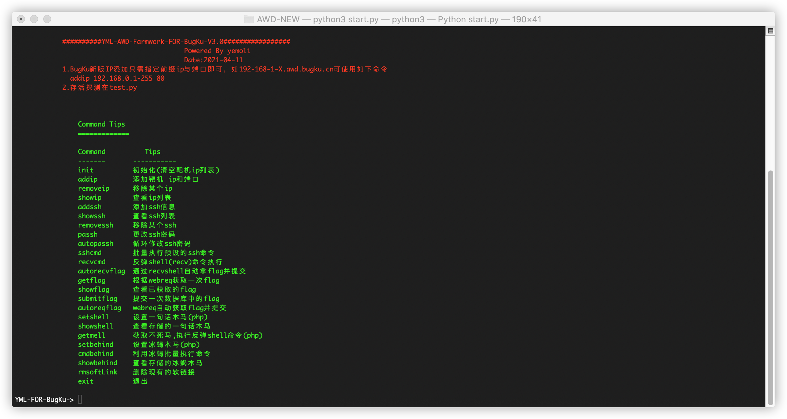
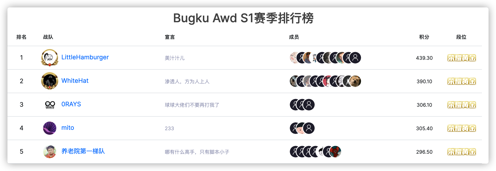

# YML-AWD-FRAME-FOR-BUGKU
使用过程稍复杂，Star超过100写详细使用教程

## 框架介绍

项目构建开始于20年年底，后来恰巧Bugku出了awd的竞赛模式，就着手制作了Bugku专版，该版本适配于域名模拟局域网的最新模式，主要功能如下图

主要功能有：批量更改ssh，批量管理反弹shell，批量快速利用一句话后门，批量利用冰蝎shell后门，批量生成软链接后门，批量提交flag等等

框架开发过程中借鉴了github上一些已有的项目和代码，详情请见末尾标注

## 开源目的

1.目前Bugku的awd出现了web+pwn的竞赛模式，所以需要更多的师傅加入我们战队，目前战队LittleHamburger位列awd排名第一

2.在最近的几个月的竞赛中，萌生出很多新的awd竞赛套路，但由于本人开发水平不高，致使框架间各个功能耦合度太高，扩展很困难；对于防守方面目前同样在开发自动化防御框架，所以希望能寻找志同道合的师傅加入LittleHamburger一起重构awd框架，将萌生的想法落地。

## 特别鸣谢

特别鸣谢如下项目和文章，该框架众多灵感和部分代码均源于此

https://github.com/Dawnnnnnn/AwdAttackFramework

https://github.com/WangYihang/Platypus

https://xz.aliyun.com/t/8590

https://xz.aliyun.com/t/6520

